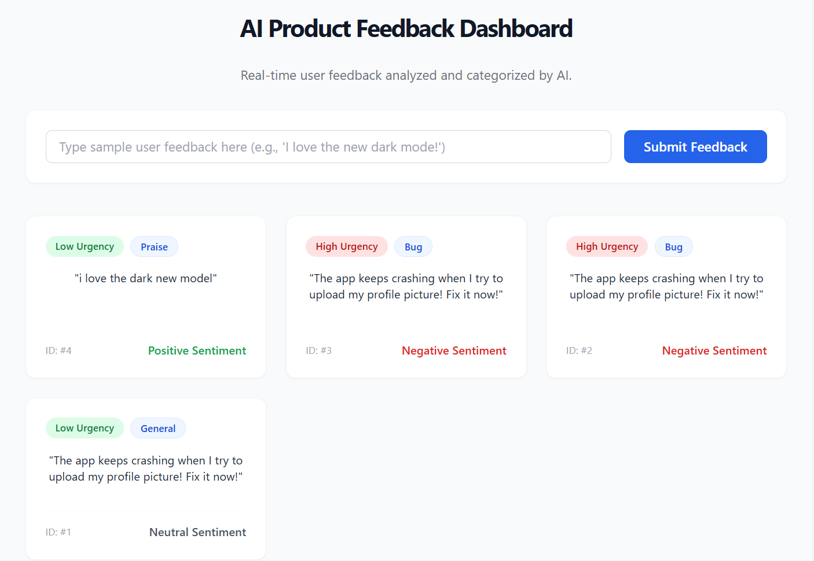

# AI Product Feedback Dashboard

An end-to-end AI application built to automate user feedback analysis, simulating a real-world product management triage tool.

## Tech Stack
* **Frontend:** React.js, Tailwind CSS
* **Backend:** Python, FastAPI
* **AI Agent:** Google Gemini 2.5 Flash API
* **Database:** PostgreSQL (NeonDB)

## How it Works
The application uses the Google Gemini API as an intelligent agent. When a user submits raw feedback, the AI analyzes the text and automatically categorizes it by:
1. **Sentiment** (Positive, Neutral, Negative)
2. **Category** (Bug, Feature Request, Praise, General)
3. **Urgency** (High, Medium, Low)

The data is then saved to a PostgreSQL database and instantly rendered on the React dashboard for product teams to review.
